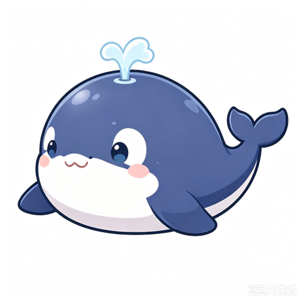

# 🐳 鲸鱼娘桌宠

> 一只**蓝色女仆 Q 版鲸鱼娘**，住在你的电脑桌面上，实时感知 **DeepSeek Harness（DSH）** 的 AI 状态，陪你干活、撒娇、长大。

她会在你让 AI 干活时跟着变：**思考 → 歪头推理，干活 → 敲代码，完成 → 吃大白米饭 🍚，报错 → 惊慌抱头**，还能跟你聊天、攒养成、查用量。



## 🎬 她的日常（每个状态都是动态 GIF）

| 待机 · 呼吸眨眼 | 思考 · 歪头推理 | 干活 · 敲代码 |
|---|---|---|
|  |  |  |

| 完成 · 吃大白米饭 | 报错 · 惊慌抱头 | 趴睡 · 睡着啦 |
|---|---|---|
|  |  |  |

### 💖 互动表情（单击 / 面板按钮触发）

| 摸头 · 害羞 | 开心 · 蹦跳 | 生气 · 鼓腮 |
|---|---|---|
|  |  |  |

> 角色设定：蓝色女仆装 Q 版鲸鱼娘，蓝发、白围裙、蝴蝶结、头顶呆毛、身后有鲸鱼尾巴。傲娇又粘人，爱吃大白米饭。

---

## ✨ 功能亮点

- **🤖 实时感知 AI 状态**：监听 DSH 原生事件流，AI 思考/干活/完成/报错，她全程跟随
- **💬 心声气泡**：AI 正在输出的文字实时显示在她头顶，像在悄悄念叨
- **🐳 和鲸鱼娘聊天**：傲娇的她陪你唠嗑（deepseek-chat），可在宠物页给她起名字
- **💰 余额与用量**：填 DeepSeek API Key 后，面板查看余额、本轮/累计 token 与费用，完成时汇报消耗
- **🌱 养成系统**：喂食/摸头提升饱腹与好感，陪 AI 干活积累成长，从鲸鱼宝宝长成鲸鱼娘
- **💖 互动表情**：摸头害羞、开心蹦跳、生气鼓腮，单击或面板按钮触发
- **😴 待机入睡**：一直待机她会慢慢趴睡（站立 → 趴睡）
- **⚠️ 审批/提问提醒**：AI 请求操作或提问时，她举手提醒你
- **🎨 素材预设**：可保存多套状态图方案，每个状态自定义换图
- **🔄 跟随 DSH 启动/退出**：DSH 启动自动拉起，退出自动关闭
- **🔌 通用 Hooks**：Claude Code / Codex / Cline 等任意工具都能推送状态驱动她
- **✨ 零依赖**：状态桥只用 Node 内置能力，透明无边框悬浮桌面

---

## 🚀 快速上手（30 秒开始用）

### 方式一：下载 exe（推荐，开箱即用）

从 [Releases](https://github.com/touche-s/rice-loving-whale/releases) 下载，**无需安装任何环境**：

- `鲸鱼娘桌宠 Setup x.x.x.exe` — 安装版（创建桌面快捷方式，可设开机自启）
- `鲸鱼娘桌宠 x.x.x.exe` — 便携版（单文件，双击即用）

**三步开始**：
1. 运行桌宠（或用 `dsh-pet-launcher` 让它跟随 DSH 自动启动）
2. 右键托盘 → 打开面板 → 设置里填 **DeepSeek API Key**（可选，填了才能聊天/查余额）
3. 在 DSH 里让 AI 干活，鲸鱼娘就会活起来！

### 方式二：源码运行

需要 Node.js ≥ 18：

```bash
cd electron
npm install
npm start
```

## 🚀 使用

1. 先启动 DeepSeek Harness Web（默认 `http://127.0.0.1:3080`）
2. 启动桌宠，托盘出现鲸鱼娘图标，窗口底部状态徽章变绿 = 已连接
3. 在 DSH 网页发起对话/工具调用，鲸鱼娘会跟随 AI 状态切换动画
### 交互

| 操作 | 效果 |
|---|---|
| 单击鲸鱼娘 | 摸头（喂饭在面板 → 宠物页 🍚） |
| 拖拽 | 移动窗口 |
| 任务栏点击 / 托盘左键 | 打开面板 |
| 托盘右键 | 显示/隐藏、切状态、打开面板、自启、退出 |

## 🖥 控制面板（鲸鱼娘的"家"）

右键托盘 → 打开面板，左侧是功能导航：

| 页面 | 功能 |
|---|---|
| 🐳 宠物 | 查看当前状态，改名字，喂饭/摸头/互动表情 |
| 🌱 养成 | 饱腹/好感/成长进度，从鲸鱼宝宝长成鲸鱼娘 |
| 🎨 素材预设 | 保存多套状态图方案，每个状态自定义换图 |
| 💬 对话 | 和傲娇的鲸鱼娘聊天（deepseek-chat） |
| 💰 用量 | 余额、本轮/累计 token 与费用、每轮结算历史 |
| ⚙️ 设置 | 状态源、DSH 地址、API Key、开机自启 |

## ⚙️ 配置

右键托盘图标 → 打开**面板** → **设置**页（或在面板左侧点 ⚙️ 设置）：

- **状态源**：
  - **DeepSeek Harness（DSH 事件流）**：监听 DSH 原生事件流实时驱动（默认）
  - **通用 Hooks 端口**：任意 AI 工具通过 curl 推送状态驱动（`http://127.0.0.1:8765/state`）
- **DSH 地址**：DSH Web 服务地址（默认 `http://127.0.0.1:3080`；局域网部署可填 `http://192.168.x.x:3080`）
- **DeepSeek API Key**：可选。填了才能查余额（`/user/balance`）和对话；会用 Windows 加密（DPAPI）存本机，明文不落盘，不会上传
- **开机自启**：登录 Windows 时自动启动

配置文件保存在 `%APPDATA%/maid-whale-desktop-pet/config.json`，也可手动编辑。

> 仓库提供了 `config.example.json` 模板（不含任何敏感信息），字段说明见文件内 `_comment`。真实配置运行时自动生成到 `%APPDATA%`，**不要**把含 Key 的 `config.json` 提交进仓库。

### 其他功能

- **🐳 和鲸鱼娘聊天**：面板 → 对话页，用你配的 API Key（deepseek-chat）。可在宠物页 ✏️ 给鲸鱼娘起名字，名字会自动带入人设。
- **💰 用量/余额**：面板 → 用量页，展示余额、本轮/累计 token 与估算费用、每轮结算历史。
- **🌱 养成**：面板 → 养成页，喂食/摸头提升饱腹与好感，陪 AI 干活积累成长。

### 通用 Hooks 端口（任意 AI 工具驱动鲸鱼娘）

桌宠内置状态端点 `http://127.0.0.1:8765/state`，任何工具/脚本一行命令即可驱动：

```bash
# GET：查询参数
curl "http://127.0.0.1:8765/state?state=thinking&text=正在思考"
# POST：JSON
curl -X POST http://127.0.0.1:8765/state -H "content-type: application/json" \
  -d '{"state":"working","text":"正在写代码"}'
```

支持的状态：`thinking` / `working` / `completed` / `error` / `idle`（含别名：done→completed、failed→error 等）。

**Claude Code 示例**（`~/.claude/settings.json` 的 hooks 配置）：

```json
{
  "hooks": {
    "Stop": [{ "hooks": [{ "type": "command", "command": "curl -s \"http://127.0.0.1:8765/state?state=completed\"" }] }],
    "SessionStart": [{ "hooks": [{ "type": "command", "command": "curl -s \"http://127.0.0.1:8765/state?state=working\"" }] }]
  }
}
```

> 更多工具的接入示例（Codex / Cline / Cursor / Windsurf 等）与跨平台通知脚本 `hook-notify.js` 见 [`hooks-examples/`](./hooks-examples/README.md)。

## 🔌 独立运行状态桥（开发/调试）

项目根提供独立模式，验证 DSH 事件流链路：

```bash
node dsh-status-bridge.js
# 参数：--base http://127.0.0.1:3080  --transport auto|websocket|sse  --debug
```

应看到 `✅ SSE CONNECTED`（mux + host 双流）和状态切换日志。

## 🧠 技术说明

```
DSH (dsh web) ──ws──▶ ws-client.js（手写 RFC6455，免 Origin）──▶ dsh-status-bridge.js
                                                                      │ 双流 mux/host、防抖、idle 超时
                                                                      ▼
                                                    Electron 主进程 ──IPC──▶ 渲染进程动画 + 心声气泡
```

- **为什么手写 WebSocket**：DSH 的 `client-connection` 对 `GET /api/events.*` 硬编码返回 426，且 WS 握手有 Origin 同源校验（`file://` 页面会被 403）。桥在主进程用不带 Origin 的裸握手连接，兼容 Electron 28（Node 18，无全局 WebSocket）。
- **状态防抖**：1.5s（同状态事件不重置窗口），8s 无事件自动回 idle。
- 帧格式：`{"type":"server-request","rpcId":"…","method":"<payload.type>","payload":{…}}`

## ❓ 常见问题

**Q：桌宠窗口没出现？**
A：窗口是透明无边框，显示在屏幕右下角；确认 DSH 已启动、托盘图标存在（右键可"显示鲸鱼娘"）。

**Q：状态徽章一直是灰色/无边框？**
A：未连上 DSH。检查：DSH Web 是否在跑、设置里的地址是否正确、端口是否被占用。

**Q：AI 干活时桌宠不动？**
A：先跑 `node dsh-status-bridge.js` 看日志是否打印 `✅ SSE CONNECTED` 和状态切换；若 `426`/`403`，确认 DSH 版本（需支持 `dsh web` 模式的浏览器传输）。

**Q：心声气泡不显示？**
A：心声来自 `assistant/chunk` 的 text-delta 流，仅在 thinking 状态显示；有些模型只输出 reasoning 块时可能较少。

## 🛠 开发

```bash
cd electron
npm install
npm run check   # 语法检查
npm start       # 运行
npm run build   # 打包便携版
npm run build-installer  # 打包安装版
```

发布新版本：打 tag 推 GitHub，[workflow](./.github/workflows/build-release.yml) 自动构建 Release。

## 📁 项目结构

```
├── dsh-status-bridge.js      # 状态桥（项目根入口，独立运行验证）
├── dsh-plugin/               # DSH client 插件（网页内桌宠，生态原生）
│   ├── package.json          # dsh.client 声明 + ./client exports
│   └── lib/client.js         # 单文件 bundle：状态机 + 浮层 UI
├── dsh-pet-launcher/         # DSH 宿主插件：让桌宠跟随 DSH 启动/退出
├── electron/
│   ├── main.js               # 主进程：窗口/托盘/桥/对话/用量
│   ├── ws-client.js          # 零依赖 WebSocket 客户端（RFC 6455）
│   ├── dsh-status-bridge.js  # 状态桥实现（双流/防抖/idle/心声）
│   ├── config.js             # 配置读写
│   ├── credentials.js        # API Key 加密存储（Windows DPAPI）
│   ├── usage.js              # 余额查询 + 用量/费用统计（usage.json）
│   ├── presets.js            # 素材预设（多套状态图方案可切换/自定义图）
│   ├── renderer.js           # 渲染进程：动画/互动/心声气泡/待机入睡
│   ├── panel.html/js         # 控制面板（宠物/养成/素材/主题/用量/对话/设置/日志）
│   ├── nurture.js            # 养成系统
│   ├── hooks-server.js       # 通用 Hooks 状态端点
│   └── assets/               # 16:9 立绘动图（idle/thinking/coding/success/error/sleep + 图标/头像）
├── extension/                # （可选）VS Code 扩展雏形
└── config.example.json       # 配置模板（不含敏感信息）
```

## 🙏 致谢

- 角色形象为原创 Q 版女仆鲸鱼娘
- 参考开源生态：[vscode-pets](https://github.com/tonybaloney/vscode-pets)、[duzexu/desktop-pet](https://github.com/duzexu/desktop-pet)、[dsh-dafeiyu](https://github.com/QCYTSN/dsh-dafeiyu)

## 📄 License

MIT
